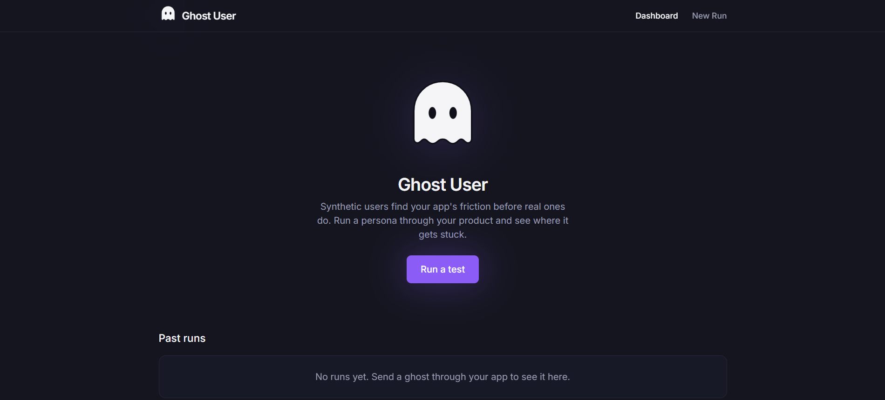
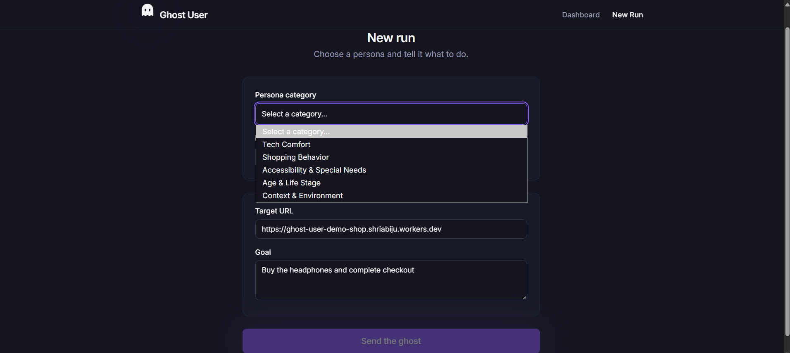
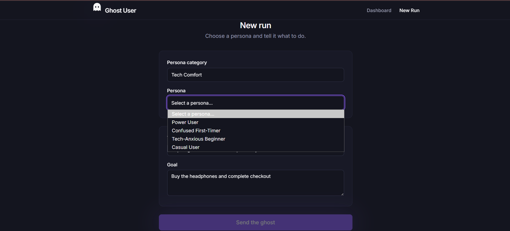
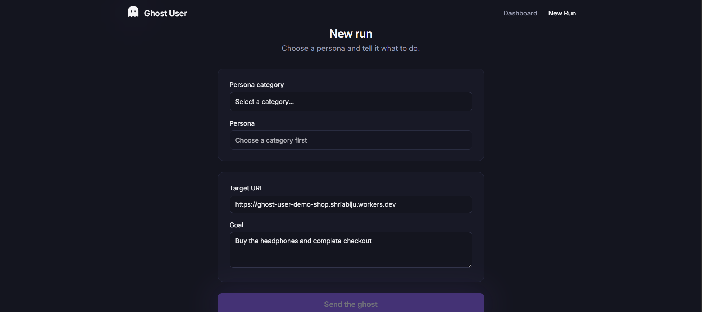
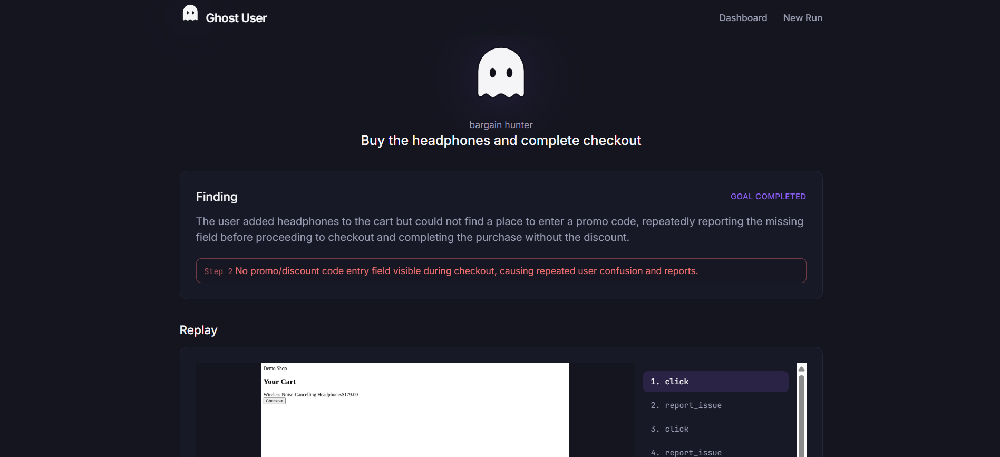
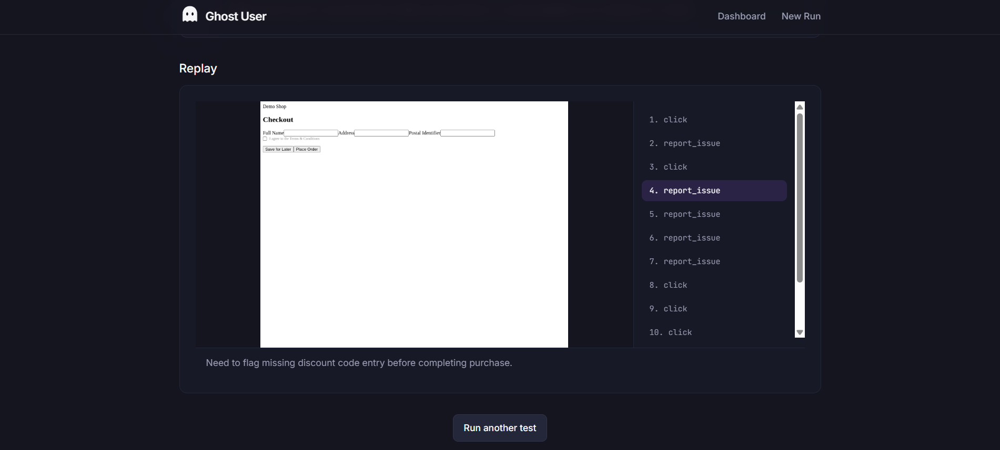

# 👻 Ghost User

**A synthetic user simulator for testing web apps.**
AI agents — each roleplaying a different kind of user — browse your app, take real
actions in a real browser, hit friction, and report what went wrong. Before real
users do.

🔗 **Live demo:** https://ghost-user-frontend.shriabiju.workers.dev
🔗 **Demo app under test:** https://ghost-user-demo-shop.shriabiju.workers.dev
🔗 **API:** https://ghost-user.onrender.com

> Note: the deployed backend is on a free tier and sleeps after ~15 min of
> inactivity — the first request after a while may take 30-60s to wake up.

---

## What it does

1. Pick a **persona** (Impatient User, Confused First-Timer, Skeptical Shopper,
   Low-Vision User, etc. — 23 in total across 5 categories) and give it a goal
   ("buy the headphones and complete checkout").
2. An agent loop launches a real headless browser (Playwright) pointed at your
   app, and repeats: **observe** the page → an LLM **decides** the next action
   in character for that persona → the browser **executes** it.
3. Every step — action, reasoning, screenshot — is logged.
4. At the end, a second LLM pass reads the full trace and writes a plain-English
   finding: goal completed / abandoned / blocked, with specific flagged issues.
5. The frontend shows a step-by-step replay plus the final report.

## Why this is different from scripted QA

There's no predefined path. The agent looks at real page state each step and
decides what a plausible user of that type would do next — and different
personas don't just move at different speeds, they *notice different things*.
A screen-reader-style persona and an impatient one can look at the same page
and flag completely different problems.

## Screenshots

**Dashboard** — past runs at a glance, with status and a "Run a test" entry point.



**Persona category picker** — 23 personas grouped into 5 categories, kept behind a dropdown so nothing's cluttered by default.



**Persona selection** — once a category's chosen, pick the specific persona and see its description before starting a run.



**New run setup** — choose a persona, set the target URL and goal, then send the ghost.



**Finding** — the LLM-generated, plain-English report: outcome plus specific, severity-tagged issues.



**Replay** — step-by-step trace with the app's screenshot and the agent's reasoning at each step.



## Tech stack

- **Frontend:** React + Vite + Tailwind + Framer Motion, deployed on Cloudflare Workers
- **Backend:** FastAPI, deployed on Render (Docker, using Microsoft's official
  Playwright image)
- **Database:** PostgreSQL (Neon), via SQLAlchemy
- **Browser automation:** Playwright (Chromium)
- **LLM:** Groq API (`openai/gpt-oss-120b`), tool-calling for a constrained
  action schema (click / type / scroll / wait / report_issue / done)

## Project structure

```
backend/     FastAPI app — DB models, agent loop, Playwright driver, report generator
frontend/    React dashboard
demo-app/    A small, intentionally flawed checkout flow used as the "app under test"
docs/        Architecture notes
```

## Running it locally

**Backend**
```
cd backend
pip install -r requirements.txt --break-system-packages
playwright install chromium
# copy .env.example to .env and fill in DATABASE_URL / GROQ_API_KEY
python run.py
```
> `run.py` (not `uvicorn ... --reload`) is required on Windows — Playwright needs
> asyncio's ProactorEventLoop, which uvicorn's `--reload` doesn't reliably carry
> into its Windows subprocess. See `docs/ARCHITECTURE.md` for details.

**Demo app**
```
cd demo-app
npm install
npm run dev   # http://localhost:5174
```

**Frontend**
```
cd frontend
npm install
npm run dev   # http://localhost:5173
```